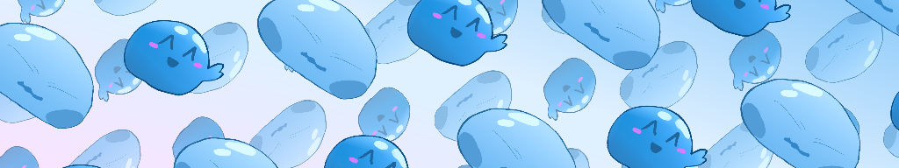
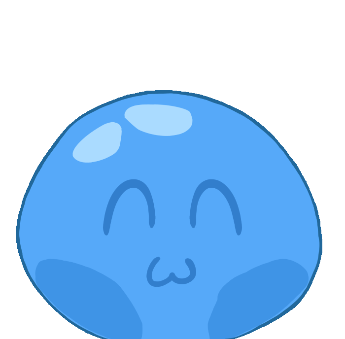
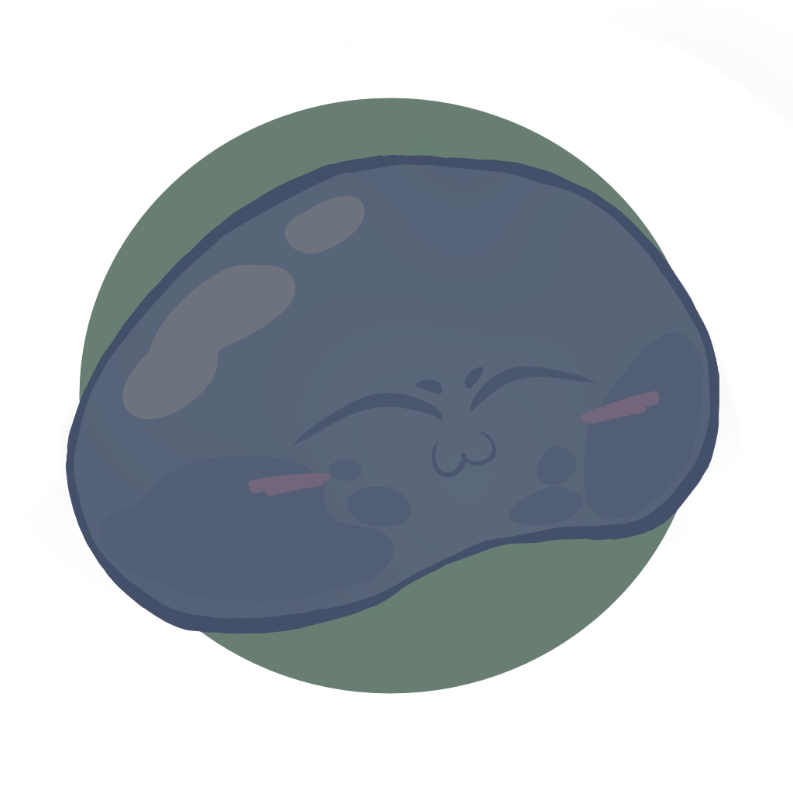
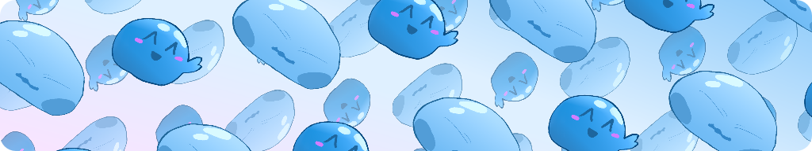

  

<!-- SLIME BOUNCIES ^^ -->

  <h1>
    
    &nbsp; MYU CORUMU &nbsp;
    
  </h1>
  
<b>Light blue slime writing code & tinkering with game dev.</b>

  
  <!-- SOCIALS -->
  

    
    
    
  

  

&nbsp;

<!-- CURRENT STATUS -->
<h3>
  
  &nbsp; Status
</h3>

- **Building**: Nice READMEs and Slime art!
- **Planning**: Slime game where you protect the innocent creatures! 

&nbsp;

<!-- LANGS & TOOLS -->
<h3>
  
  &nbsp; Favorites
</h3>

  <!-- I use more... but here are the most important! -->
  <!-- Languages -->
  
  
  
  
  
  
  
  
   
  
  <!-- Tools -->
  
  
  
  

&nbsp;

<!-- STATS -->
<h3>
  
  &nbsp; Stats
</h3>

  
  

  

